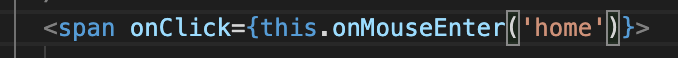
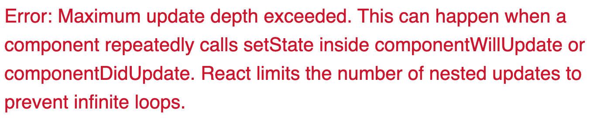

# 坑复现

# onClick 相关

## Description

在 onClick 中传入一个函数，此函数内有 setState，并且需要给这个函数传入一个参数。

-   如下图写法:



-   报错如下：



## 原因

onClick 内传如函数错误，当没有括号时传入的是 function 对象，点击之后会调用该函数，但是当需要给入参数时必须加括号，这是传入的不再是个对象，变成了函数调用，所以会出现无限次 setState 最后达到最大刷新深度。

## 解决方案

-   若不需要给函数传入参数时，这么写没有问题
-   若需要给函数传入参数时，这应该在 onClick 中传入一个回调函数，在回调函数中调用这个函数。写法如下:

```javascript
<span onClick={() => this.onMouseEnter('home')}></span>
```

<br/>

# Persistent Login 相关

## Description

在实现 Persistent Login 时，出现如下一系列问题：

1. 手动登录后，点击 Myprofile 报错`_id of null`
2. 前期想着用 onClick 调用一个回调函数，里面分别发一次 getUser 请求和改变登录状态，但还是一样报错

3. 于是想到用 lifecycle method，重新理了一下逻辑：

-   当正常 persistent login 的时候，我希望在 render 页面之前就获得登录状态，为了实现这个效果正好可以在这个时候用 getUser 请求，将浏览器中的 cookie 带过去，若返回 200，这说明一切正常可以登录，与此同时也获得了 user 的信息，故可以用`UNSAFE_componentWillMount`
-   当手动登录时在点击 Myprofile 便还是遇到 1 的报错。于是又重新理了一下逻辑，我希望的是 render 页面之后可以自动去发 getUser 的请求，然后我就想到了 componentDidMount，当还是不成功

4. 和女朋友（嘿嘿，对！我有女朋友！哦不，未婚妻！）打完电话然后睡觉前突然灵光一闪，好像我一开始逻辑就有点问题。于是乎睡觉的时候重新理了一下逻辑：
   浏览器输入 url 之后的顺序应该是这样的：首先浏览器服务器发送页面请求到后端服务器，后端服务器返回 html 对象。然后浏览器解析，渲染。如果之前已经有登录过（浏览器中有 cookie），会在渲染前执行`UNSAFE_componentWillMount`（之后也不需要在执行 componentDidMount）获得登录状态和用户信息，然后一切正常；但是如果之前没有登录过（浏览器中没有 cookie），等渲染前还是会执行`UNSAFE_componentWillMount`以及第一次渲染后会执行`componentDidMount`，但是这两次都相当于什么都没做，原因是此时浏览器没有 cookie，所以不会发送 getUser 的请求。所以正确的做法应该是用 `ComponentDidUpdate` 来监控登录状态，如果登录状态更新且为登录的情况，这发送 getUser 请求，然后更新用户数据。（感觉好像可行）。按照这个逻辑实现了之后，发现报出了一个新的错误说是"invalid token"。
5. 改了之后发现还是报 1 的错误。
6. 至此问题都解决了。

## 原因

1. 因为手动登录只是发送了确认请求可以登录返回的是 200 OK 和 jwt，并没有 user 信息，所以此时点击 Myprofile 因为 user 还是 null，所以会报错`_id of null`。
2. 原因是请求需要时间。
3. 在页面渲染之后这个函数确实自动被 call 了，也像其官方文档介绍的，我在这里写请求数据也没毛病，但为什么不成功呢？因为页面渲染之后就马上执行了这个函数，在执行这个函数时（手动登录前）浏览器中的 cookie 还没有（因为没有发送登录请求，服务器不会生成 token 并返回），所以 getUser 看到 cookie 还是 undefined 就自动不发送请求了。但是我在 UI 体验上面并没有意识到这一点，我想当然的认为我在页面渲染了之后马上手动登录了为什么 getUser 的请求就是没法更新 state 中 user 的信息，一度以为是 setState 的坑（晚上十二点，还没吃饭，脑子成浆糊了，才会这么想）。然后又以为是不是请求有时间需要异步，然后分别尝试了 async/await 和 promise 都没成功。放弃决定吃饭休息。
4. 原来是粗心直接把 token 字段给到了 getUser 方法
5. 看了浏览器之后发现已经有 cookie 了，思考了一下可能是手动登录发送请求后，在设置 cookie 和到设置完 cookie 可能有个时间差，而此时登录状态已被更新，触发了 ComponentDidUpdate，所以在手动登录 promise 的 then 里面多加了一个`getCookie('token') != undefined`.

> 部分相关 bug 代码

```javascript
//file1.js
export const getUser = (token, callback = () => {}) => {
	if (token != undefined) {
		console.log('did run');
		const decodedJWT = jwtDecode(token);
		const headerConfig = {
			headers: {
				'x-auth-token': token,
			},
		};
		const URL = '/users/' + decodedJWT._id;
		BaseProvider.get(URL, headerConfig)
			.then((res) => {
				// console.log({ res })
				callback(res.data.data);
			})
			.catch((err) => console.log({ err }));
	}
};

//file2.js
class Homepage extends React.Component {
	state = {
		isAuthenticated: false,
		showProfile: false,
		showLoginCard: false,
		headerMouseOver: '',
		user: null,
	};

	setUserAndState = (data) => {
		this.setState({
			isAuthenticated: true,
			user: data,
		});
	};

	//when there is no cookies, the getUser request will not be sent,
	//see the definition
	UNSAFE_componentWillMount = () => {
		const currentCookie = getCookie('token');
		getUser(currentCookie, this.setUserAndState);
	};

	//This code snippet is useless, because when the page first rendered in a condition of not logined, there is no cookies, so the getUser request will not be sent. Therefore this code did nothing in its lifecycle.
	//see the definition
	componentDidMount = () => {
		if (this.state.user === null) {
			getUser(getCookie('token'), this.setUserAndState);
		}
	};

	renderLogout = () => {
		return (
			<div className="item">
				<a
					className={this.state.headerMouseOver === 'signout' ? 'active right item' : 'right item'}
					onMouseEnter={() => this.onMouseEnter('signout')}
					onMouseLeave={this.onMouseLeave}
				>
					<span
						onClick={() => {
							this.setState({
								isAuthenticated: false,
								showProfile: false,
								showLoginCard: false,
								user: null,
							});
							deleteCookie('token');
						}}
					>
						Log out
					</span>
				</a>
			</div>
		);
	};

	renderAfterLogin = () => {
		return (
			<div className="item">
				<a
					className={this.state.headerMouseOver === 'myprofile' ? 'active right item' : ' right item'}
					onMouseEnter={() => this.onMouseEnter('myprofile')}
					onMouseLeave={this.onMouseLeave}
				>
					<span
						onClick={() => {
							this.setState({ showProfile: !this.state.showProfile });
						}}
					>
						Myprofile
					</span>
				</a>
			</div>
		);
	};

	renderBeforeLogin = () => {
		return (
			<div className="item">
				{this.state.showLoginCard || (
					<a
						className={this.state.headerMouseOver === 'signin' ? 'active item primary' : 'item primary'}
						onMouseEnter={() => this.onMouseEnter('signin')}
						onMouseLeave={this.onMouseLeave}
					>
						<span onClick={() => this.setState({ showLoginCard: true })}>Sign In</span>
					</a>
				)}
			</div>
		);
	};

	render() {
		return (
			<div className="pusher">
				...
				{this.state.showLoginCard && <AuthCard onAuthenticated={this.onAuthenticated} />}
				<div>
					{this.state.showProfile && (
						<SiderBar visible={this.state.showProfile} userDetail={this.state.user} />
					)}
				</div>
				...
			</div>
		);
	}
}

export default Homepage;
```

## 解决方案

就是按照 Description 4 的逻辑实现了一下，然后把后续的两个小 bug 解决掉就都好了。

<br/>

# Logic bugs 相关

## Description

背景：

要重复利用创建操作时用的 modal

问题：

点击编辑然后关闭 modal 后，再点击创建时，上次点击编辑传入的数据还保留在 modal 上

## 原因

在点击创建打开 modal 没有重置传入 modal 的数据

### 错误代码

```javascript
UNSAFE_componentWillReceiveProps = (nextProps) => {
	const { currentParam } = nextProps;

	if (currentParam !== null) {
		this._id = currentParam._id;
		this.setState({
			name: currentParam.name,
			description: currentParam.description,
		});
	}
};
```

### 正确代码

```javascript
<Button
	type="primary"
	shape="round"
	className="button"
	onClick={() => {
		this.setState({
			currentParam: null,
		});
		this.handleCategoryEdit();
	}}
>
	New Category
</Button>
```

```javascript
UNSAFE_componentWillReceiveProps = (nextProps) => {
	const { currentParam } = nextProps;

	if (currentParam !== null) {
		this._id = currentParam._id;
		this.setState({
			name: currentParam.name,
			description: currentParam.description,
		});
	} else {
		this._id = '';
		this.setState({
			name: '',
			description: '',
		});
	}
};
```

## 解决方法

如上正确代码展示

# 后言

以上皆为自己实操经验，如有不喜，勿喷！欢迎指正。若博君欢心，欢迎`star`一下。

[>>Back to Home](../README.md)
