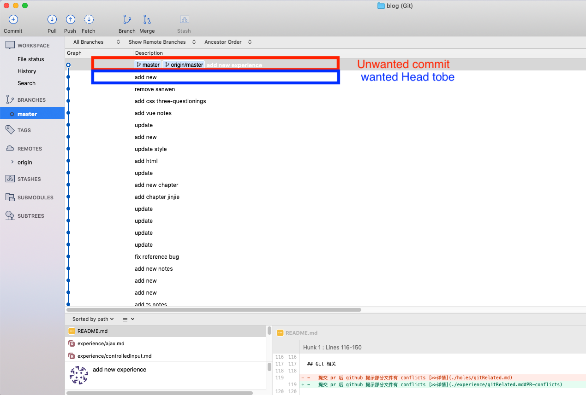
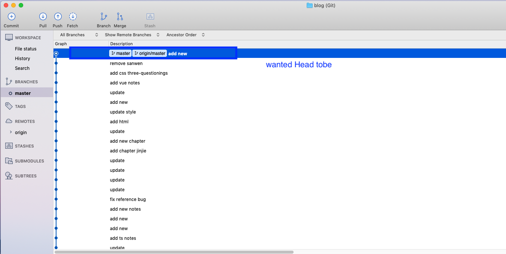

# 提交PR有冲突

## Description

在贡献开源项目[covid-19-au.github.io](https://github.com/covid-19-au/covid-19-au.github.io)时提交 pr 后 github 提示有部分文件有 conflicts。

## 原因

查看了 conflict 的代码之后，发现造成 conflict 的原因是因为在开发的过程中有其他开发人员更改了相关的文件，使得自己开发基于的版本不是最新。

## 解决方案

得益于 source tree 的视觉效果，做了以下更改解决了这个问题。

-   将 commit reset 到开发时的 commit
-   git stash 保存所有的更改
-   更新开发版本
-   git stash pop 将所做的开发内容 pop 到现在的版本
-   重新 commit，然后 push 代码。

 

# 远端仓库手添文件造bug

## Description

git pull 远端的 master 之后，一直显示有一个 local 文件被改动，但是不管怎样 discard 又会有另外一个极为相近的文件显示刚刚 discard 掉的内容为新的改动，git pull 就说要先 stash local changes，但是 git stash 之后还是有这些 changes

## 原因

有人直接在远端添加了其中一个文件，然后又之后在本地推了一个名称差不多的文件，所以导致前面两个文件 discard 其中一个，另外一个就显示之前 discard 的改动为新的改动

## 解决方案

（确保自己本地所做的开发都已经推上去），强制更新本地的 master，方法如[帖子](https://stackoverflow.com/questions/1125968/how-do-i-force-git-pull-to-overwrite-local-files)

 

# Undo一条commit

## Description

有时候需要在push之后回滚且不想要在历史上有痕迹

## 解决方案

跑如下命令：

- `git reset --hard HEAD~1`
>> If the code in this commit is still needed, replace flag 'hard' with 'mixed'
- `git push -f`

## 效果

 

# 后言

以上皆为自己实操经验，如有不喜，勿喷！欢迎指正。若博君欢心，欢迎`star`一下。

[>>Back to Home](../README.md)
