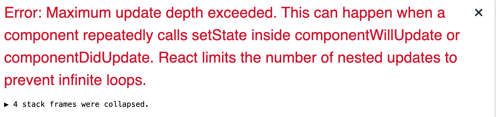
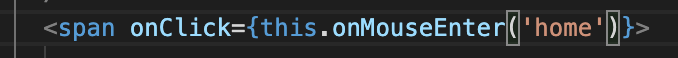
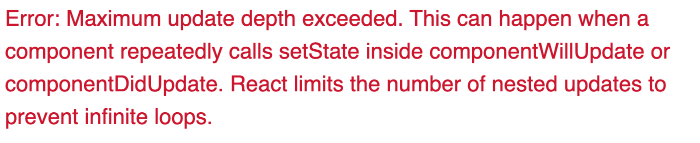

# 坑复现

# setState 相关

## Description 1

arraw function 里的 setState 不能更新 state 或者更新有问题

## 原因

-   掉坑体验 1:

    -   是因为状态默认设置是 string 类型 1，然后赋值的时候是数字类型的 1，然后用`===`比较得出 false 的结果，导致 component 显示出现问题

-   掉坑体验 2:
    -   是因为在一个 div 里有 onClick 设置 state 为真，然后在其子自定义组件里 onClick 设置为假，然后最后结果看起来就是子组件明明将值返回到回调函数，但是就是不能更新 state 变为 false。分析下来发现，点击子组件里的 div 时也会同时出发了父组件里的 onClick 事件。

## 解决方案

-   掉坑体验 1:
    -   将所有的值都用同一类型
-   掉坑体验 2:
    -   父组件下面在多加一个 div 或者 span 的 tag，然后就 onClick 移到那里去，不放在父组件的 div

<br/>

## Description 2

setState 更新 state 中的 object 类型变量，部分已经 state 中声明的 object 里面的 key 在之后的调用中变成 undefined

报错展示：


## 原因

steState 更新 object 类型的方式错误

示例代码

```javascropt
state = {
    profile: {
      user: null,
      restaurants: [],
    },
  }
```

错误更新

```javascript
this.setState((prevState) => ({
	profile: {
		user: newUserData,
	},
}));
```

正确更新

```javascript
this.setState((prevState) => ({
	profile: {
		...prevState.profile,
		user: newUserData,
	},
}));
```

## 解决方案

如原因分析中正确更新代码块

<br/>

## Description 3

背景：
子组件内有一个到其他页面的点击时间，但是这个页面的 routes 是动态的，也就是 App.js 需要每次 render 之前向后端请求数据，然后 render 出所以页面的 routes，初始状态为[]

问题：
在子组件点击链接后，会新开一个页面，但是就是会 redirect 到 not-found，App.js 的数据也明明都有请求过来。（说明 routes 还是有问题）

## 原因

子组件链接点击之后其实是会到目标页面，但是因为 reload 了页面又重新将 App.js 的状态初始化了，所以导致 redirect 到 Not-found。然后会 reload 页面的原因是因为链接 element 用了`<a>` tag.

App.js 代码

```javascript
state = {
	restaurants: [],
};

componentDidUpdate = (prevProps, prevState) => {
	if (prevState.restaurants !== this.state.restaurants) {
	}
};

fetchRestaurants = (restaurants) => {
	if (restaurants !== undefined && restaurants.length > 0) this.setState({ restaurants: restaurants });
};

renderRestaurantRoutes = () => {
	if (this.state.restaurants.length > 0) {
		return this.state.restaurants.map(({ _id, name, description }) => (
			<div key={_id}>
				{console.log('did update5', _id, '/restaurants/' + _id, name)}
				<Route exact path={'/restaurants/' + _id}>
					<Resturant
						details={{
							name: name,
							description: description,
						}}
					/>
				</Route>
				<Route exact path={'/restaurants/' + _id + '/waiter'}>
					<Waiter />
				</Route>
				<Route exact path={'/restaurants/' + _id + '/cook'}>
					<Kitchen />
				</Route>
				<Route exact path={'/restaurants/' + _id + '/manager'}>
					<Manager />
				</Route>
				<Route exact path={'/restaurants/' + _id + '/cashier'}>
					<div>cashier</div>
				</Route>
				<Route exact path={'/restaurants/' + _id + '/customer'}>
					<Customer />
				</Route>
			</div>
		));
	}
	return null;
};
```

错误代码

```javascript
if (restaurants && restaurants.length > 0) {
	console.log('rrest ', restaurants);
	return restaurants.map(({ _id, name }) => (
		<span key={_id}>
			<h3>{name}</h3>
			<a href={'/restaurants/' + _id}>
				<i className="caret square right icon" />
			</a>
		</span>
	));
}
```

## 解决方案

将`<a>` tag 换成`react-route-dom`的`<Link>`就行。

小记：
这个 bug 修复花了我讲多时间是因为找到原因之后忘记了`react-route-dom`的`<Link>`，而是一味的 google 如何到新页面不用 reload，导致误导了方向。

<br/>

# lifeCycle Method 相关

## Description 1

modal 渲染的内容需要根据 props 的数据的不同而变化，但无论是在 render（）方法里用 setState 还是单独写一个函数都会报错`Maximum update`



错误代码

```javascript
class RestaurantModal extends React.Component {
	...
	render(){
		const { editingRestaurant } = nextProps
		if (editingRestaurant !== null) {
			this.setState({
				name: editingRestaurant.name,
				description: editingRestaurant.description,
			})
		}
		return(...)
	}
}
```

正确代码

```javascript
UNSAFE_componentWillReceiveProps = (nextProps) => {
	const { editingRestaurant } = nextProps;
	if (editingRestaurant !== null) {
		this.setState({
			name: editingRestaurant.name,
			description: editingRestaurant.description,
		});
	}
};
```

## 原因

这种情况下 setState 的方法不对

## 解决方案

应该用`UNSAFE_componentWillReceiveProps`并且配合参数`nextProps`

<br/>

# onClick 相关

## Description

在 onClick 中传入一个函数，此函数内有 setState，并且需要给这个函数传入一个参数。

-   如下图写法:



-   报错如下：



## 原因

onClick 内传如函数错误，当没有括号时传入的是 function 对象，点击之后会调用该函数，但是当需要给入参数时必须加括号，这是传入的不再是个对象，变成了函数调用，所以会出现无限次 setState 最后达到最大刷新深度。

## 解决方案

-   若不需要给函数传入参数时，这么写没有问题
-   若需要给函数传入参数时，这应该在 onClick 中传入一个回调函数，在回调函数中调用这个函数。写法如下:

```javascript
<span onClick={() => this.onMouseEnter('home')}></span>
```

<br/>

# Ajax 请求相关

## Description

-   掉坑体验 1:

    -   axios 发送请求时，报错 cors preflight

-   掉坑体验 2:

    -   axios 发送请求时，一直显示 400 Bad request

-   掉坑体验 3:
    -   axios 发送请求时，catch log 出来的 error 不是 object 形式显示

## 原因

-   掉坑体验 1:

    -   cors 类别的错误都是由于违背同源策略
    -   产生 prefile 的原因：[详见这个帖子](https://stackoverflow.com/questions/29954037/why-is-an-options-request-sent-and-can-i-disable-it)

-   掉坑体验 2:

    -   发送请求 400 Bad request, 有很多原因，但一般是前端发送的请求违反了某些规定，比方说语法错误，数据格式问题等
    -   这次错误的原因是因为给 form 的 onSubmit 传的第二个参数是个 array，然后用 es6 语法解析 array 的时候把数据的参数和其他参数顺序对掉了，导致发送请求的数据包格式错误，返回 400，正好又因为同时有【掉坑体验 3】，所以当时 debug 起来就有点难受。

-   掉坑体验 3:
    -   这个原因很蠢，是因为前端打印的时候没有 log({error})这样

## 解决方案

-   掉坑体验 1:

    后端配置 cors,[详见官方文档](https://www.npmjs.com/package/cors)

-   掉坑体验 2:

    把顺序调回去。

*   掉坑体验 3:
    -   这个原因很蠢，是因为前端打印的时候没有 log({error})这样

<br/>

# Persistent Login 相关

## Description

在实现 Persistent Login 时，出现如下一系列问题：

1. 手动登录后，点击 Myprofile 报错`_id of null`
2. 前期想着用 onClick 调用一个回调函数，里面分别发一次 getUser 请求和改变登录状态，但还是一样报错

3. 于是想到用 lifecycle method，重新理了一下逻辑：

-   当正常 persistent login 的时候，我希望在 render 页面之前就获得登录状态，为了实现这个效果正好可以在这个时候用 getUser 请求，将浏览器中的 cookie 带过去，若返回 200，这说明一切正常可以登录，与此同时也获得了 user 的信息，故可以用`UNSAFE_componentWillMount`
-   当手动登录时在点击 Myprofile 便还是遇到 1 的报错。于是又重新理了一下逻辑，我希望的是 render 页面之后可以自动去发 getUser 的请求，然后我就想到了 componentDidMount，当还是不成功

4. 和女朋友（嘿嘿，对！我有女朋友！哦不，未婚妻！）打完电话然后睡觉前突然灵光一闪，好像我一开始逻辑就有点问题。于是乎睡觉的时候重新理了一下逻辑：
   浏览器输入 url 之后的顺序应该是这样的：首先浏览器服务器发送页面请求到后端服务器，后端服务器返回 html 对象。然后浏览器解析，渲染。如果之前已经有登录过（浏览器中有 cookie），会在渲染前执行`UNSAFE_componentWillMount`（之后也不需要在执行 componentDidMount）获得登录状态和用户信息，然后一切正常；但是如果之前没有登录过（浏览器中没有 cookie），等渲染前还是会执行`UNSAFE_componentWillMount`以及第一次渲染后会执行`componentDidMount`，但是这两次都相当于什么都没做，原因是此时浏览器没有 cookie，所以不会发送 getUser 的请求。所以正确的做法应该是用 `ComponentDidUpdate` 来监控登录状态，如果登录状态更新且为登录的情况，这发送 getUser 请求，然后更新用户数据。（感觉好像可行）。按照这个逻辑实现了之后，发现报出了一个新的错误说是"invalid token"。
5. 改了之后发现还是报 1 的错误。
6. 至此问题都解决了。

## 原因

1. 因为手动登录只是发送了确认请求可以登录返回的是 200 OK 和 jwt，并没有 user 信息，所以此时点击 Myprofile 因为 user 还是 null，所以会报错`_id of null`。
2. 原因是请求需要时间。
3. 在页面渲染之后这个函数确实自动被 call 了，也像其官方文档介绍的，我在这里写请求数据也没毛病，但为什么不成功呢？因为页面渲染之后就马上执行了这个函数，在执行这个函数时（手动登录前）浏览器中的 cookie 还没有（因为没有发送登录请求，服务器不会生成 token 并返回），所以 getUser 看到 cookie 还是 undefined 就自动不发送请求了。但是我在 UI 体验上面并没有意识到这一点，我想当然的认为我在页面渲染了之后马上手动登录了为什么 getUser 的请求就是没法更新 state 中 user 的信息，一度以为是 setState 的坑（晚上十二点，还没吃饭，脑子成浆糊了，才会这么想）。然后又以为是不是请求有时间需要异步，然后分别尝试了 async/await 和 promise 都没成功。放弃决定吃饭休息。
4. 原来是粗心直接把 token 字段给到了 getUser 方法
5. 看了浏览器之后发现已经有 cookie 了，思考了一下可能是手动登录发送请求后，在设置 cookie 和到设置完 cookie 可能有个时间差，而此时登录状态已被更新，触发了 ComponentDidUpdate，所以在手动登录 promise 的 then 里面多加了一个`getCookie('token') != undefined`.

> 部分相关 bug 代码

```javascript
//file1.js
export const getUser = (token, callback = () => {}) => {
	if (token != undefined) {
		console.log('did run');
		const decodedJWT = jwtDecode(token);
		const headerConfig = {
			headers: {
				'x-auth-token': token,
			},
		};
		const URL = '/users/' + decodedJWT._id;
		BaseProvider.get(URL, headerConfig)
			.then((res) => {
				// console.log({ res })
				callback(res.data.data);
			})
			.catch((err) => console.log({ err }));
	}
};

//file2.js
class Homepage extends React.Component {
	state = {
		isAuthenticated: false,
		showProfile: false,
		showLoginCard: false,
		headerMouseOver: '',
		user: null,
	};

	setUserAndState = (data) => {
		this.setState({
			isAuthenticated: true,
			user: data,
		});
	};

	//when there is no cookies, the getUser request will not be sent,
	//see the definition
	UNSAFE_componentWillMount = () => {
		const currentCookie = getCookie('token');
		getUser(currentCookie, this.setUserAndState);
	};

	//This code snippet is useless, because when the page first rendered in a condition of not logined, there is no cookies, so the getUser request will not be sent. Therefore this code did nothing in its lifecycle.
	//see the definition
	componentDidMount = () => {
		if (this.state.user === null) {
			getUser(getCookie('token'), this.setUserAndState);
		}
	};

	renderLogout = () => {
		return (
			<div className="item">
				<a
					className={this.state.headerMouseOver === 'signout' ? 'active right item' : 'right item'}
					onMouseEnter={() => this.onMouseEnter('signout')}
					onMouseLeave={this.onMouseLeave}
				>
					<span
						onClick={() => {
							this.setState({
								isAuthenticated: false,
								showProfile: false,
								showLoginCard: false,
								user: null,
							});
							deleteCookie('token');
						}}
					>
						Log out
					</span>
				</a>
			</div>
		);
	};

	renderAfterLogin = () => {
		return (
			<div className="item">
				<a
					className={this.state.headerMouseOver === 'myprofile' ? 'active right item' : ' right item'}
					onMouseEnter={() => this.onMouseEnter('myprofile')}
					onMouseLeave={this.onMouseLeave}
				>
					<span
						onClick={() => {
							this.setState({ showProfile: !this.state.showProfile });
						}}
					>
						Myprofile
					</span>
				</a>
			</div>
		);
	};

	renderBeforeLogin = () => {
		return (
			<div className="item">
				{this.state.showLoginCard || (
					<a
						className={this.state.headerMouseOver === 'signin' ? 'active item primary' : 'item primary'}
						onMouseEnter={() => this.onMouseEnter('signin')}
						onMouseLeave={this.onMouseLeave}
					>
						<span onClick={() => this.setState({ showLoginCard: true })}>Sign In</span>
					</a>
				)}
			</div>
		);
	};

	render() {
		return (
			<div className="pusher">
				...
				{this.state.showLoginCard && <AuthCard onAuthenticated={this.onAuthenticated} />}
				<div>
					{this.state.showProfile && (
						<SiderBar visible={this.state.showProfile} userDetail={this.state.user} />
					)}
				</div>
				...
			</div>
		);
	}
}

export default Homepage;
```

## 解决方案

就是按照 Description 4 的逻辑实现了一下，然后把后续的两个小 bug 解决掉就都好了。

<br/>

# 后言

以上皆为自己实操经验，如有不喜，勿喷！欢迎指正。若博君欢心，欢迎`star`一下。

[>>Back to Home](../README.md)
