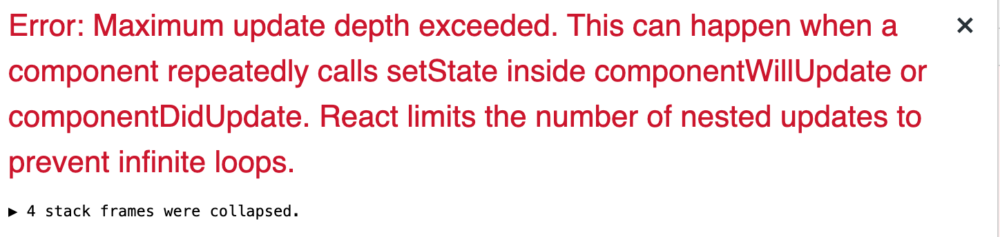

# lifeCycle Method 相关

## Description 1

modal 渲染的内容需要根据 props 的数据的不同而变化，但无论是在 render（）方法里用 setState 还是单独写一个函数都会报错`Maximum update`



错误代码

```javascript
class RestaurantModal extends React.Component {
	...
	render(){
		const { editingRestaurant } = nextProps
		if (editingRestaurant !== null) {
			this.setState({
				name: editingRestaurant.name,
				description: editingRestaurant.description,
			})
		}
		return(...)
	}
}
```

正确代码

```javascript
UNSAFE_componentWillReceiveProps = (nextProps) => {
	const { editingRestaurant } = nextProps;
	if (editingRestaurant !== null) {
		this.setState({
			name: editingRestaurant.name,
			description: editingRestaurant.description,
		});
	}
};
```

## 原因

这种情况下 setState 的方法不对

## 解决方案

应该用`UNSAFE_componentWillReceiveProps`并且配合参数`nextProps`

<br/>

# 后言

以上皆为自己实操经验，如有不喜，勿喷！欢迎指正。若博君欢心，欢迎`star`一下。

[>>Back to Home](../README.md)
