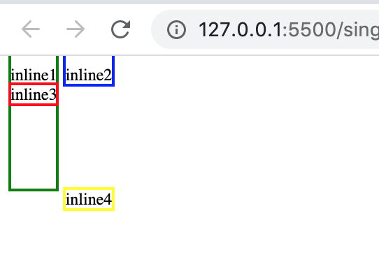

# 灵魂一问：你真的了解块级元素和内联元素吗？

一个网页内的元素显示是按照normal flow的概念从上到下进行的，因此自然便会有同行显示还是另起一行的问题。这里便涉及到了html的块级元素（block）和内联元素（inline）。

通俗来理解，块级元素总是单独占据一行，而内联元素元素不会单独占据一行，可以跟前一个不介意分享一行的元素同行显示。

块级元素如其英文名block，是方方正正的一块区域，因此有width和height。通过css可以对其width、height进行调整，同时可以对其margin/padding的top和bottom进行设置从而实现想要的样式风格。

然而，对于内联元素来说，垂直方向上的设置在视觉上并不能起到效果。可能有的同学会问，为什么说视觉上不能？不是就是不能吗？

这里要说明下，对于内敛元素，垂直方向的margin设置确实没有任何作用，当padding视觉上虽然没有，但是看边框确实被撑大了。如下示例：

```html
<div id="app">
  <span class="span-1">inline1</span>
  <span class="span-2">inline2</span>
  <div>
    <span class="span-3">inline3</span>
    <span class="span-4">inline4</span>
  </div>
</div>
```

```css
.span-1 {
  padding: 100px 0;
  margin-top: 100px;
  border: 2px solid green;
}
.span-2 {
  padding-top: 100px;
  border: 2px solid blue;
}
.span-3 {
  border: 2px solid red;
}
.span-4 {
  border: 2px solid yellow;
  position: relative;
  top: 100px;
}
```

效果图如下：



再看`span-4`，top却好像是有作用的，这是因为top改变的是其在normal flow中的位置，而不是其元素本身，所以这个与是否为块级还是内敛元素没有非常大的关系。

> 注：这里所说的内联元素是指内联非替换元素，像`img`这样的内联替换元素还是可以改变其宽和高的。

# 灵魂二问：你真的了解position吗？

大家都知道position可以取：`static`, `relative`, `absolute`, `fixed`, `sticky`, 以及不太常见的`inherit`。要很好的理解这个属性，**大家必须要时刻谨记网页元素的展示是按照normal flow进行的**。

- static

  默认取值。可以理解为没有添加position属性。元素在normal flow中正常出现，这时候会忽略 top, bottom, left, right 或者 z-index。

- relative
  生成相对定位的元素。这是相对于元素本身在normal flow中的正常位置进行定位。它在normal flow中所占的空间仍然保留。当这个时候，可以使用 top, bottom, left, right 或者 z-index对元素进行自定义的定位。

- absolute：
  生成绝对定位的元素。这是相对于 static 定位以外的第一个祖先元素（offset parent）进行定位。它原先占据的空间会从normal flow中完全删除。且不论原来它在正常流中生成何种类型的框，元素都会在定位后生成一个块级框。当然也可以 top, bottom, left, right 或者 z-index对元素进行定位，**牢记这时候的位移都是相对于这个非static定位的第一个祖先元素位置**。

- fixed：
  元素框的表现类似于将 position 设置为 absolute，不过其是相对于viewport（或者说是浏览器窗口）进行定位的。也不存在于normal flow当中。

- sticky：
  CSS3新属性，兼容性较差，有点类似 position: relative 和 position: fixed 的结合体。其在文档流中的位置如fixed，是相对于viewport。

  它常用于滚动固定。在目标区域屏幕内时，它的行为就像 position: relative; 而当页面滚动超出目标区域时，它的表现就像 position: fixed，它会固定在目标位置。

- inherit：从父元素继承 position 属性的值。不太常见。

# 灵魂三问：内容A固定，但是却发现滚动上来的内容B在固定区域还是依稀可见甚至覆盖，怎么办？

首先实现内容的固定可以通过position的fixed或者sticky然后配合top/bottom/right/left来达到目的，并不难。但是，有个实现之后却发现一个问题：内容固定后，**下面的内容滚动上来之后却在固定区域没有被覆盖**。

这显然不是理想的状态。

在google了一圈之后，网上大多数只提到了第一部分：如何固定，却没有任何提到这个问题的解决方法。（也可能是我关键词太差？google算法不牛逼？）

作为css小白的我确实为之苦恼了半天，甚至想到了写一段js来实现滚动到特定区域后，将滚动的内容fade-in这样的复杂操作😂。之后在同事提醒下，灵感一闪，找到了解决方案：`z-index`！！

简单理解，这个属性所做的工作其实就是设置不同内容在第三维度上的上下层级关系。如果把屏幕想象成x轴和y轴，那这个属性所做的工作就是指定内容在垂直于屏幕的z轴方向的排列顺序。之后找个章节，我们再来详细的探讨下这个`z-index`～