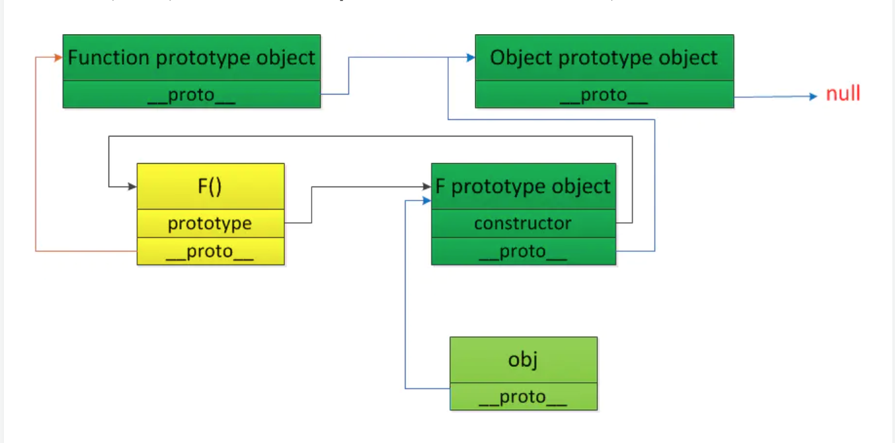
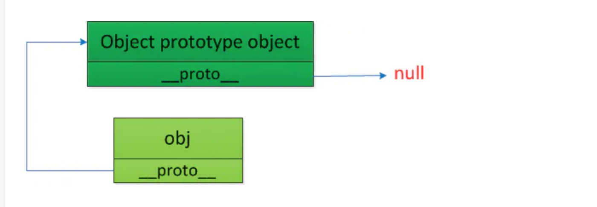

## 原型链

> 讲完继承，来说说原型链

原型链简单的理解就是从当前对象开始，通过`__proto__`属性连接起来的一连串的对象。

> `__proto__`是所以 js 对象的内部属性，其指向当前对象继承的父类对象，或者 null（表示不继承任何对象或方法）。

### 原理

当我们引用了某个属性或者方法，js 就会顺着原型链查找，即首先查找当前对象本身，若没有找到该属性或方法，则会通过当前对象的`__proto__`属性查找上一层对象，若还是没有找到，就继续往上层对象查找，直到到达最初的原型对象，如果依然没有找到就会返回`undefined`。

#### Prototype 属性

prototype 属性存在于 JavaScript 的任何函数当中，这个属性指向的对象就是所谓的原型对象，在构造原型链时需要原型对象。

#### Javascript 中已经存在的原型链


> JS 中的 9 个 built-in 函数：`Object`， `Function`，`Array`， `String`，`Boolean`， `Number`，`Date`， `Error`，`RegExp`和 1 个 built-in 的`Math`对象。
>
> 通过这 9 个 `built-in函数`我们可以创建相应的对象，同时，这 9 个`built-in函数`的 `prototype`属性所指向的原型对象也是`built-in`的。

-   所有**built-in 函数对象**的原型链最终都指向`Function prototype object`
-   所有**非函数对象(即`built-in函数`的 `prototype`属性所指向的原型对象)的原型链**最终都指向 `Object prototype object`
-   `Function prototype object`的 `__proto__`属性也指向`Object prototype object`， `Object prototype object`的`__proto__`属性指向为 `null`。

由此可知，

-   `Object prototype object`是所有原型链的顶端
-   所有 `built-in`函数对象同时继承了`Object prototype object`和 `Function prototype object`上的属性和方法，而所有非 built-in 函数对象只继承了`Object prototype object`上的方法。
-   `Function prototype object`包含了所有函数共享的属性和方法，而`Object prototype object`包含了所有对象都共享额属性和方法。

#### 创建对象时，原型链的构造过程

**对象创建方式**

-   new 方法

-   对象字面量的方式

    > ```javascript
    > var obj = { name: 'Jim Green' };
    > ```

**原型链构造过程**

1. **使用函数的方式构造对象**

    构造对象分为两步：

    - 定义一个函数 F()作为构造函数

        > 此时，js 会为我们做两件事情：
        >
        > - 根据定义的函数创建函数对象
        >
        > - 设置这个函数对象的`__proto__` 属性和`prototype`属性
        >
        > > 1. `__proto__` 指向`Function prototype object`
        > > 2. `prototype`指向为该函数新建的原型对象(`F prototype object`)，这个原型对象通过调用 new Object()构造出来，并且为这个新创建的原型对象添加了`constructor`属性，该属性指向这个函数对象 F

    - 使用 new 方法构造对象 obj

        > 此时 js 会为我们做两件事情：
        >
        > - 分配内存作为新创建的对象 obj
        > - 将 obj 对象的`__proto__`属性指向函数 F 的原型对象`F prototype object`



        > 如果我们想知道一个对象是由哪个方法构建的，只需要访问这个对象的 `constructor`属性即可。同时，由于`F prototype object`是由 Object()创建，其`__proto__`属性指向函数 F 的原型对象`Object prototype object`

2. **使用对象字面量定义对象**

当使用对象字面量构造对象时，js 会为我们做两件事情：

-   分配内存作为新创建的对象 obj
-   将新创建对象的 `__proto__`属性指向 `Object prototype object`


