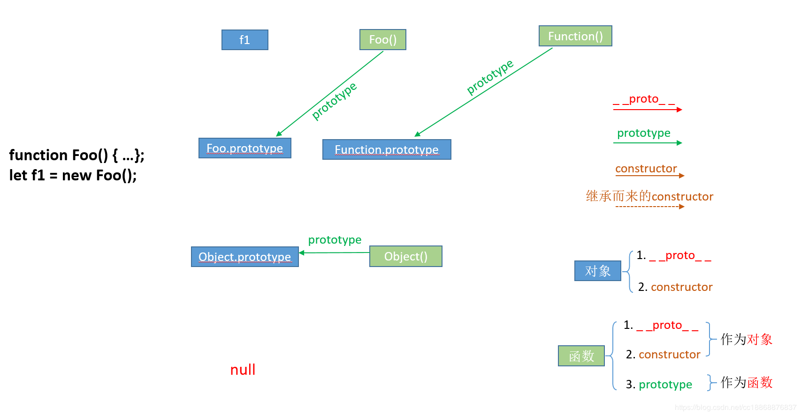

# 面向对象编程 2

## 数据类型和包装类

| 包装类   | 类型名    | 分类         |
| -------- | --------- | ------------ |
| Number   | number    | 原始数据类型 |
| Boolean  | boolean   | 原始数据类型 |
| String   | string    | 原始数据类型 |
| Object   | object    | 复合数据类型 |
| Function | function  | 特殊类型     |
| /        | undefined | 小数据类型   |
| /        | null      | 小数据类型   |
## 引用类型和值类型

引用类型：`object`、`function`

值类型：`number`、`boolean`、`string`、`null`、`undefined`

## `new function`（构造器）和`prototype`（原型）

`new`方法构造对象：

```javascript
function f() {
  this.id = 0;
}
var a = new f();
```

本例中，当使用`function`构造对象时，js进行如下流程：

1. 查找`f`的`prototype`，并进行浅拷贝

2. 绑定`this`指针到拷贝来的对象

3. 将`this.constructor`属性设置为`f`

   > 注意和将某个之类的prototype超类实例化的差别

4. 执行用户`{}`中的代码

5. 返回`this`指针赋予左值`a`

## 实现面向对象的三个特征

### 封装

> 重点在于访问权限

在其他原生支持面向对象语言中，一般支持 `public`、`protected`、`private` 三个关键字来控制访问权限，但在js中只能依靠作用域关系来控制。

```javascript
function classname(a){
  var uid=a; //uin 为模拟 private，作用域为 {}，外部无法使用
  this.getuid=function(){return a;} // 为 uid 提供一个外部只读接口 obj.getuid();
  this.setuid=function(val){a=val} // 为 uid 提供一个外部可写接口 obj.setuid(5);
  this.id=uid; //id 为模拟 public obj.id 使用
}
classname.prototype.func=function(){}; // 模拟 public 方法 obj.func() 调用
classname.stafunc=function(){}; // 模拟静态方法 classname.stafunc() 调用
var obj=new classname(1);
```

注意以下两点：

- 因为 `function` 是引用类型 ，`classname.prototype.func` 是所有对象实例共享的一个` function` 对象（每个对象仅存着引用），因此对象规模不大。但是，`this.getuid` 和 `this.setuid`都定义了一个 `function`，因此每个对象实例都存了一份，如果放肆的使用就会使得对象规模庞大，而影响性能。

- 若真有大量使用`this.xxx=function(){}`的需求，最好在类定义的首行加上 `var _this = this`， 这样在`this.xxx=function(){}` 中也可以方便使用绑定

  的指针。

  > 个人理解：这样做的目的可能是因为在大量的使用`this.xxx=function(){}`时，可能会出现在操作当前的dom元素对象时可能还会需要之前的dom元素对象。而这样可以有效的避免混乱或错误。
  >
  > 《浅谈JavaScript》原文中在这个地方解释的不是非常清楚，个人理解，这么做并不能提高性能，只是可以更方便的操作dom元素的对象。如果纰漏，欢迎指正。

### 继承

主要有两种方法：

- 使用 javascript 本身的原型模型，通过给 prototype 赋值并改变其 constructor 属性来实现继承。

  > ```javascript
  > A.prototype=new B();
  > A.prototype.constructor=A;
  > //如果要实现多继承的话，prototype就真的好麻烦了（需要依次多个类，还要建空对象来接--看下面多态的例子）
  > ```

- 不使用 prototype，手动实现将父对象的所有属性方法深拷贝到子对象。

  > 一般这种继承为了找父类方便，可以在对象中加个属性，引用父类。

### 多态

> 这里函数重载就不赘述了，可参见第三章

需要注意的是，如果是打算继承 B 类的 `prototype`，**一定要建一个空对象来接**，否则的话，你给类写方法的话，相当于直接修改了 `prototype`，就算不写方法，你最后修改 `constructor` 时也会造成继承链错乱，接个空对象很容易。

```javascript
function temp(){};
temp.prototype=B;
var obj=new temp();
```

这样再让需要继承 `B.prototype` 的类继承 `obj` 即可，即便修改 `prototype` 也不会影响到 `B`，也不像继承 `new B()` 那样浪费很多空间。

## 深拷贝与浅拷贝

讲深浅拷贝之前，先再来讲一下数据类型及其区别。

数据类型分：

- 原始数据类型：`number`, `string`, `boolean`, `undefined`, `null`
- 引用数据类型:`object(Array, Date, RegExp, Function)`

两种类型的区别：

- 保存位置不同。

  > 原始数据类型保存在栈内存中，引用数据类型保存在堆内存中，然后在栈内存中保存了数据在堆内存中的地址，即引用。
  >
  > **为什么保存位置不同？**
  >
  > - 堆比栈大，栈比堆块；
  > - 原始数据类型比较稳定，且占用内存小；
  > - 引用数据类型大小是动态的，而且是无限的，引用值的大小会改变，故不能放在栈中，否则会降低变量查找的速度。但该对象在对内存中的地址是大小固定的，所以在栈中存储内存堆变量性能没有任何负面的影响。
  >
  > ECMAScript中所有函数的参数都是按值来传递的。
  >
  > - 对于原始值，只是把变量里的值传递给参数，之后参数和这个变量互不影响；
  > - 对于引用值，变量里面的值是这个对象在堆内存中的地址，因此它传递的值也就是这个地址。然后对对象的操作也是通过这个地址去引用（就像一个指针）。所以函数内部对这个参数的修改会体现在这个对象上的原因，因为它们都指向同一个对象；

- 基本数据类型使用`typeof`可以返回其基本数据类型，但是`null`类型会返回`object`，因此`null`表示一个空对象指针；引用数据类型使用`typeof`会返回`object`，需使用`instanceof`来检测引用数据类型；

### 浅拷贝

**深/浅拷贝都只针对引用数据类型**。

浅拷贝只赋值指向某个对象的指针，而不是对象本身，新旧对象依然共享同一块内存。

浅拷贝只复制对象的第一层属性。

> 浅拷贝事实上只是对第一层的深拷贝，剩下的层只复制了地址，都指向了同一内存。

`Object.assign()`实现浅拷贝：

```javascript
let obj1 = {
   a: {
     b: 1
   },
   c: 2
}
let obj2 = Object.assign({},obj1)
obj2.a.b = 3;
obj2.c = 3
console.log(obj1.a.b); // 3
console.log(obj2.a.b); // 3
console.log(obj1.c); // 2
console.log(obj2.c); // 3
```

### 深拷贝

深拷贝会另外创造一个一摸一样的对象，新旧对象不共享内存，修改任意一方都不会影响到另外一方。

深拷贝可以对对象的属性进行递归复制。

## `prototype/constructor/__proto__`

对象所独有的属性：`constructor/__proto__`

函数所独有的属性：`prototype`

> JS中函数也是对象，故函数有以上三种属性。

### `__proto__`


指向其原型对象(也可理解为父对象）。

其作用是当访问一个对象的属性时，如果该对象内部没有这个属性，就会去向上，去更高层次的原型对象中查找，直到找到为止，若在最高层也没有找到，这返回`undefined`，这也便是**原型链原理**。

### `prototype`



函数所独有，从一个函数指向一个对象。含义是**函数的原型对象**，也就是该函数所创建的实例的原型对象。

其作用是包含可以由特定类型的所有实例（该函数所实例化的对象们）都共享的属性和方法。

**任何函数在创建的时候，其实会默认同时创建该函数的prototype对象。**

### `constructor`


对象所独有，从一个对象指向一个函数。含义是**指向该对象的构造函数**。

每个对象都有构造函数（本身拥有或者继承而来）。

> - 每个对象都可以找到其对应的`constructor`，有`constructor`是创建对象的前提。
>
> - 而这个`constructor`可能是对象自己本身显式定义的或者通过`__proto__`在原型链中找到的。
>
> - 单从`constructor`这个属性来讲，只有`prototype对象`才有。每个函数在创建的时候，JS会同时创建一个该函数对应的`prototype对象`。如本例中`f1.__proto__ === Foo.prototype`，`Foo.prototype.constructor===Foo()`。
>
>   > 故通过函数创建的实例对象即使自己没有`constructor`属性，它也能通过`__proto__`找到对应的`constructor`（null如果当成对象的话，将null除外）

`Function`对象有点特殊，其构造函数是其本身，所有的函数和对象最终都是由`Function`构造函数构造而来。